# Inkvoy — Every Page Is a Voyage

A beautifully crafted book-discovery, library, tracker and reading app built in Flutter. Discover millions of books through the **Open Library API**, curate your own shelves, log every session, and read public-domain classics right inside a calm, paper-themed mini reader.

<p align="center">
  
</p>

<p align="center"><em>Splash → Pick your genres → Home → Discover → Library → Insights → Book detail → Reader → Settings</em></p>

## Features

- **Onboarding** — animated welcome slides that shape your home shelves around the genres you love
- **Genre picker** — pick up to three genres with a playful flying-cover selection effect
- **Discover** — search millions of Open Library works, filter by subject, sort by relevance / newest / top rated
- **Curated shelves** — Trending and New arrivals for your genres on the home screen
- **Library** — Want to read · Reading · Finished shelves with live progress bars and one-tap re-shelving
- **Insights** — reading time, day streaks, a 6-week habit calendar, favourite genres & authors, shareable reading "postcards"
- **Mini reader** — read public-domain text from Project Gutenberg (or an elegant preview) with paper/fixed/sepia themes, selectable serif body type, adjustable font size, line height and margins
- **Dark mode** — a full warm-dusk theme
- **Reading history** — every session is logged, so Insights grows with you

## Screenshots

| Splash | Onboarding | Genre Picker | Home |
|:---:|:---:|:---:|:---:|
|  | 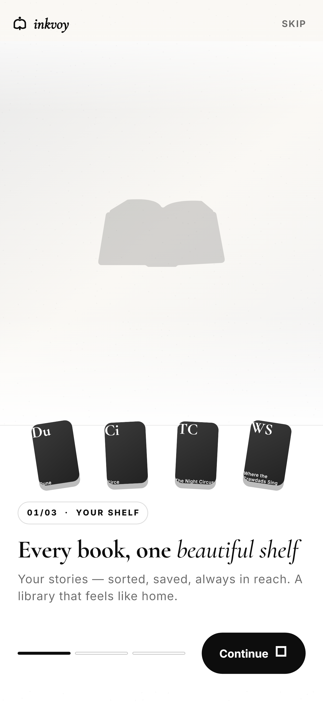 | 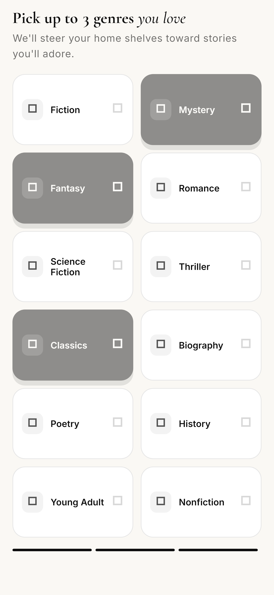 | 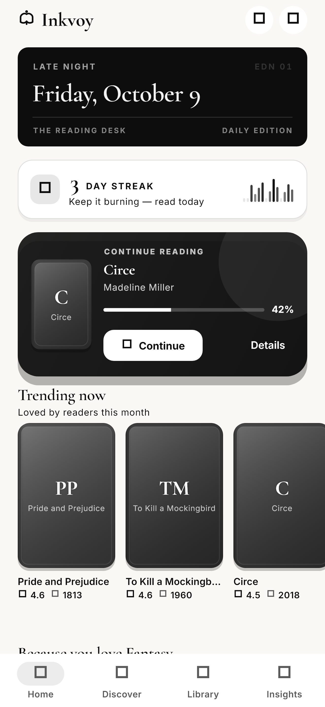 |

| Discover | Search Results | Library | Insights |
|:---:|:---:|:---:|:---:|
| 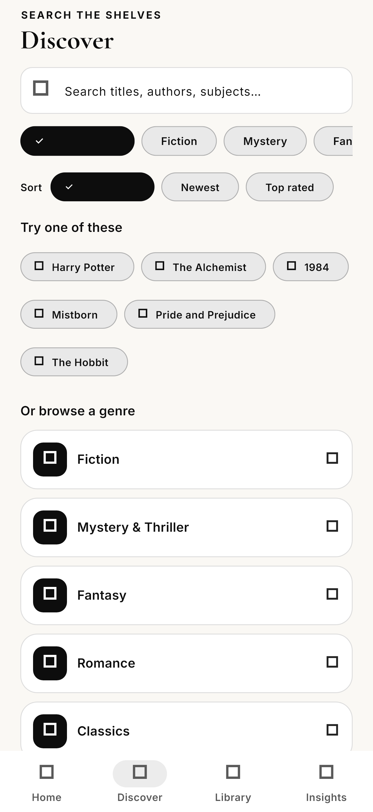 | 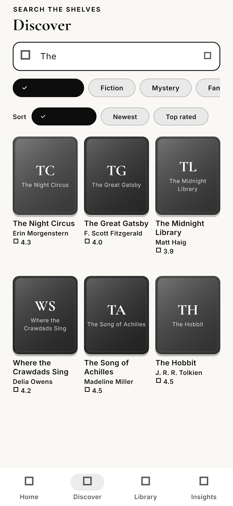 | 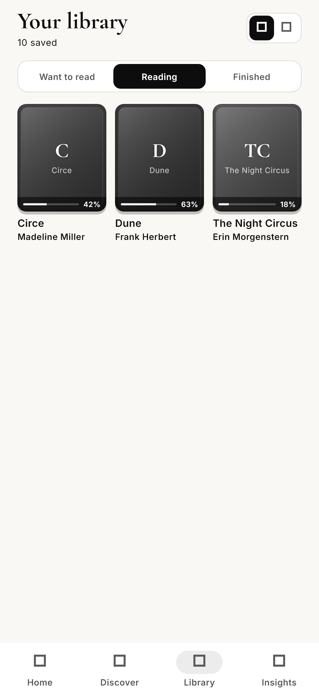 | 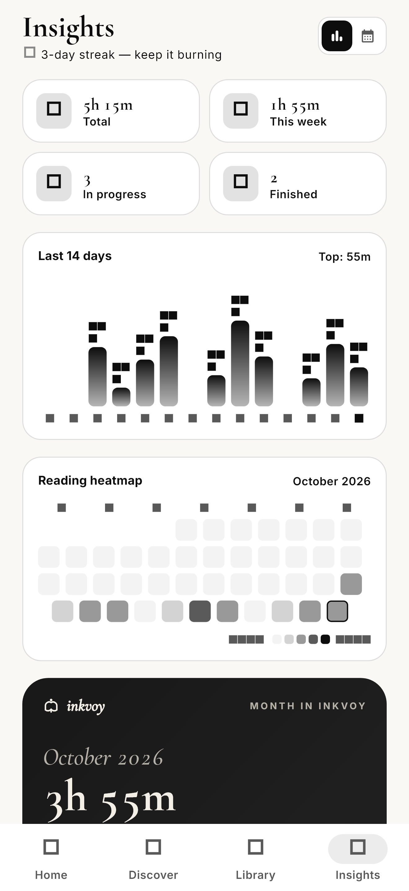 |

| Book Detail | Reader | Settings | Dark Mode |
|:---:|:---:|:---:|:---:|
| 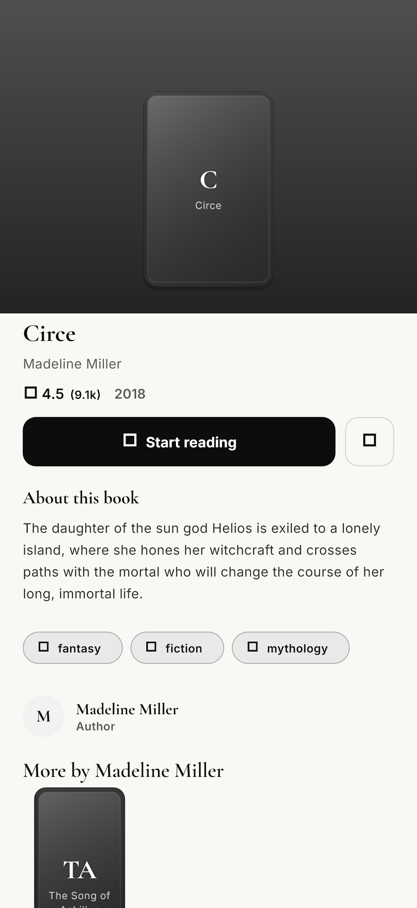 | 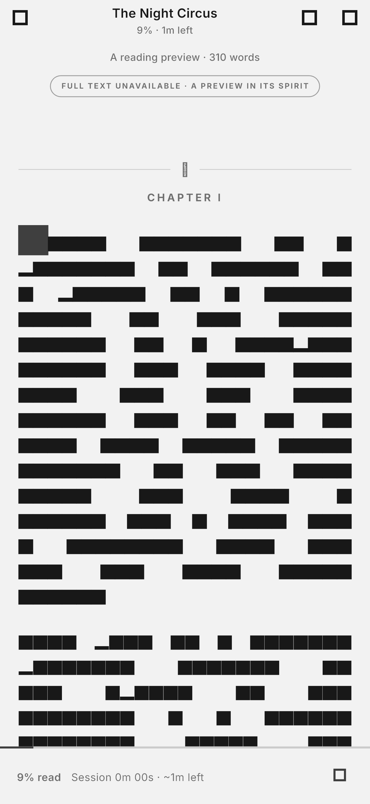 | 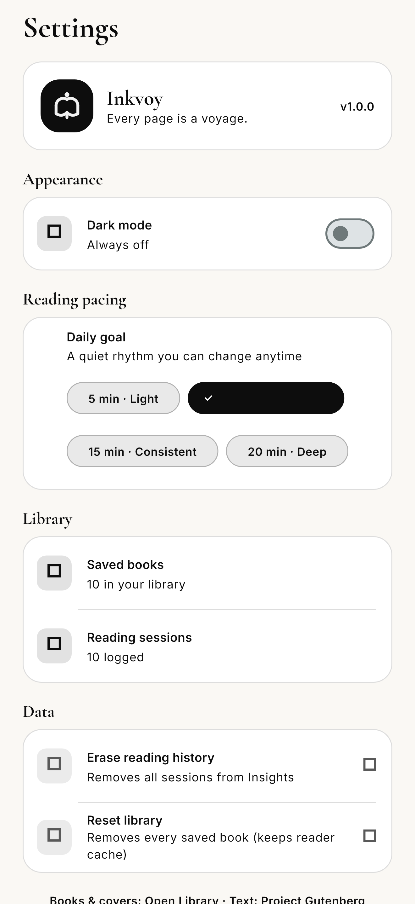 | 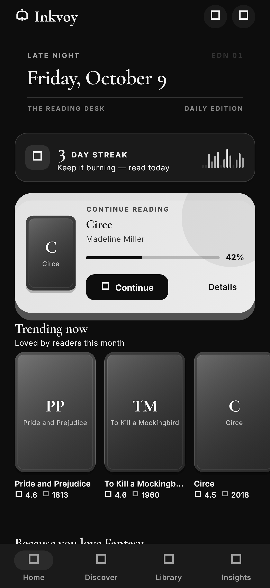 |

## Flow

```
Splash → Onboarding (pick your genres) → Home

Home tabs: Home · Discover · Library · Insights

Discover → Search Open Library → filter by subject → sort → Book detail → Add to shelf
Book detail → Start reading → Reader
Reader  → finish → rate the book → back to Library
Settings → dark mode, daily goal, reading history & library tools
```

## Getting started

Requires the [Flutter SDK](https://docs.flutter.dev/get-started/install).

```bash
flutter pub get
flutter run
```

An internet connection gives you real cover art and public-domain book text; offline, Inkvoy falls back to elegant generated covers and a curated literary preview so reading always works.

## Project structure

```
lib/
  main.dart                     – app entry & global provider scope
  core/
    api/open_library.dart       – Open Library + Project Gutenberg client
    models/                     – book, reading session, insights, sample text
    providers/                  – riverpod state (settings, shelves, sessions, reader prefs)
    router/                     – go_router navigation
    storage/hive_store.dart     – local persistence
    theme/                      – brand palette, typography & light/dark themes
    widgets/                    – book covers, gradient stages, shared states
  features/
    splash/ onboarding/         – intro & genre picker
    home/                       – personalized shelves & continue-reading
    search/                     – discover + Open Library search
    library/                    – shelf management & progress
    insights/                   – reading stats, streaks & shareable postcards
    detail/ reader/             – book detail and the mini reader
    settings/                   – appearance, pacing & data tools
assets/
  fonts/                        – Cormorant Garamond + Inter (bundled)
  onboarding/ images/           – plate art & illustrations
docs/screenshots/               – README screenshots
media/                          – demo video & GIF
test_screens/                   – golden-based screenshot harness
```

## Regenerating the screenshots

`test_screens/shots_test.dart` renders every screen to PNG with deterministic
seeded data (and offline fakes for the Open Library API), so the marketing
screenshots can be regenerated at any time:

```bash
flutter test test_screens --update-goldens
# output: test_screens/shots/*.png  (copied into docs/screenshots/)
```

## Credits

Book metadata & cover art: [Open Library](https://openlibrary.org/) · Public-domain text: [Project Gutenberg](https://www.gutenberg.org/).
Flutter implementation and demo assets by [TanimowoObaloluwaDavid](https://github.com/TanimowoObaloluwaDavid).